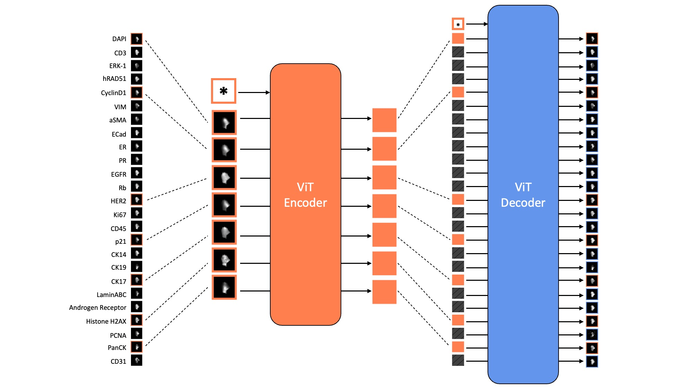

# A Masked Image Modelling Approach to Multiplex Tissue Imaging Panel Reduction

## Abstract:
Multiplex Tissue Imaging (MTI) has emerged as a powerful set of techniques that can increase the amount of information captured within a single tissue section by allowing visualization and quantification of the spatially resolved expression of various protein markers. These techniques, however, are limited in panel size due to technical artifacts, tissue loss, and long acquisition time. Using a masked image modeling approach, a reduced set of biomarkers from a cyclic immunofluorescence (CyCIF) panel in breast cancer tissue microarrays is shown to be able to reliably reconstruct an expanded marker panel that retains a sufficient amount of information from the full original panel that would be necessary for downstream analysis, thereby overcoming the limitations of conducting MTI panels. This work shows significant performance improvement over previous attempts by using a transformer-based deep learning model and adopting the self-supervised training objective of reconstructing full marker panel images cropped at the single-cell level after masking a random subset of marker channels. After training, it is then possible to probe the model to discover an optimal reduced marker panel that, along with the trained model, can be used as a substitute for the full marker panel.

## MAE References/Resources:

### Papers:
- [Computational Multiplex Panel Reduction to Maximize Information Retention in Breast Cancer Tissue Microarrays](https://www.biorxiv.org/content/10.1101/2022.08.24.505142v1.full.pdf)
  - [Repository](https://github.com/GelatinFrogs/PanelSelectionMethods)
- [Masked Autoencoders Are Scalable Vision Learners](https://arxiv.org/pdf/2111.06377.pdf)
  - [Repository](https://github.com/facebookresearch/mae)
- [How to Understand Masked Autoencoders](https://www.semanticscholar.org/reader/73fc48a264c944a6642753cbf3c96abf91910737)
- [Masked Autoencoders are Robust Data Augmentors](https://arxiv.org/pdf/2206.04846.pdf)
- [A Survey on Masked Autoencoder for Self-supervised Learning in Vision and Beyond](https://arxiv.org/pdf/2208.00173.pdf)
- [Masked Image Modeling Advances 3D Medical Image Analysis](https://arxiv.org/pdf/2204.11716.pdf)
- [Self Pre-training with Masked Autoencoders for Medical Image Analysis](https://arxiv.org/pdf/2203.05573.pdf)
- [Self-distillation Augmented Masked Autoencoders for Histopathological Image Classification](https://arxiv.or/pdf/2203.16983.pdf)
- [Multi-modal Masked Autoencoders Learn Compositional Histopathological Representations](https://arxiv.org/pdf/2209.01534.pdf)
- [Global Contrast Masked Autoencoders Are Powerful Pathological Representation Learners](https://arxiv.org/pdf/2205.09048.pdf)
- [ViTGAN: Training GANs with Vision Transformers](https://arxiv.org/pdf/2107.04589.pdf)
- [Autoencoding beyond pixels using a learned similarity metric](https://arxiv.org/pdf/1512.09300.pdf)
- [MAEDAY: MAE for few and zero shot AnomalY-Detection](https://arxiv.org/pdf/2211.14307v1.pdf)
- [Scale-MAE: A Scale-Aware Masked Autoencoder for Multiscale Geospatial
Representation Learning] (https://arxiv.org/pdf/2212.14532v2.pdf)
- [Label Mask AutoEncoder(L-MAE): A Pure Transformer Method to Augment Semantic Segmentation Datasets](https://arxiv.org/pdf/2211.11242v1.pdf)
- [ConvMAE: Masked Convolution Meets Masked
Autoencoders] (https://arxiv.org/pdf/2205.03892v2.pdf)
- [GD-MAE: Generative Decoder for MAE Pre-training on LiDAR Point Clouds](https://arxiv.org/pdf/2212.03010v2.pdf)
- [i-MAE: ARE LATENT REPRESENTATIONS IN MASKED
AUTOENCODERS LINEARLY SEPARABLE?](https://arxiv.org/pdf/2210.11470v1.pdf)
- [Multimodal Masked Autoencoders
Learn Transferable Representations](https://arxiv.org/pdf/2205.14204.pdf)

=======
- [What to Hide from Your Students: Attention-Guided Masked Image Modeling](https://arxiv.org/pdf/2203.12719.pdf)

### Code:
- [Hugging Face ViTMAE](https://huggingface.co/docs/transformers/model_doc/vit_mae)
- [Pytorch ViT implementations](https://github.com/lucidrains/vit-pytorch)
- [ViTGAN implementation](https://github.com/wilile26811249/ViTGAN)